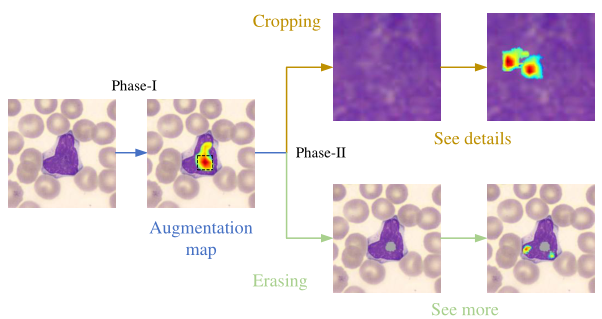

# WT-DFN
## Weakly Supervised T ernary Stream Data Augmentation Fine-Grained Classification Network for Identifying Acute Lymphoblastic Leukemia

Abstract
----------
Due to the high incidence of acute lymphoblastic leukemia (ALL) worldwide as well as its rapid and fatal progression, timely microscopy screening of peripheral blood smears is essential for the rapid diagnosis of ALL. However, screening manually is time-consuming and tedious and may lead to missed or misdiagnosis due to subjective bias; on the other hand, artificially intelligent diagnostic algorithms are constrained by the limited sample size of the data and are prone to overfitting, resulting in limited applications. Conventional data augmentation is commonly adopted to expand the amount of training data, avoid overfitting, and improve the performance of deep models. However, in practical applications, random data augmentation, such as random image cropping or erasing, is difficult to realistically occur in specific tasks and may instead introduce tremendous background noises that modify actual distribution of data, thereby degrading model performance. In this paper, to assist in the early and accurate diagnosis of acute lymphoblastic leukemia, we present a ternary stream-driven weakly supervised data augmentation classification network (WT-DFN) to identify lymphoblasts in a fine-grained scale using microscopic images of peripheral blood smears. Concretely, for each training image, wefirst generate attention maps to represent the distinguishable part of the target by weakly supervised learning. Then, guided by these attention maps, we produce the other two streams via attention cropping and attention erasing to obtain the fine-grained distinctive features. The proposed WT-DFN improves the classification accuracy of the model from two aspects: (1) in the images can be seen details since cropping attention regions provide the accurate location of the object, which ensures our model looks at the object closer and discovers certain detailed features; (2) images can be seen more since erasing attention mechanism forces the model to extract more discriminative parts’ features. Validation suggests that the proposed method is capable of addressing the high intraclass variances located in lymphocyte classes, as well as the low interclass variances between lymphoblasts and other normal or reactive lymphocytes. The proposed method yields the best performance on the public dataset and the real clinical dataset among competitive methods. Our code is available at [Pytorch-(WT-DFN)](https://github.com/YunDuanFei/WT-DFN).

--------------------------------------------------
OpenTSNE visualizations, where the green and orange points represent lymphoblasts and nor-mal leukocytes, respectively. Cluster labels are not shown for visual clarity. 

Attention maps represent discriminative parts of the object. The regions with high attention co-efficients are cropped and up-sampled to extract more detailed part features for “see details”. The remaining regions after erasing the regions with high attention are used to generate more discriminative object parts for “see more”.

Our environments and toolkits
-----------

- OS: Ubuntu 18.04.5
- CUDA: 10.2
- Python: 3.7
- Toolkit: PyTorch 1.7.0
- GPU: RTX 2080Ti (2x)

Citation
--------
If you find WT-DFN useful in your research, please consider citing:

    Liu, Yunfei, Pu Chen, Junran Zhang, Nian Liu, and Yan Liu. 2022. "Weakly Supervised Ternary Stream Data Augmentation Fine-Grained Classification Network for Identifying Acute Lymphoblastic Leukemia" Diagnostics 12, no. 1: 16. https://doi.org/10.3390/diagnostics12010016

## Contact Information

If you have any suggestion or question, you can contact us by: liuyunfei_215@163.com. Thanks for your attention!

